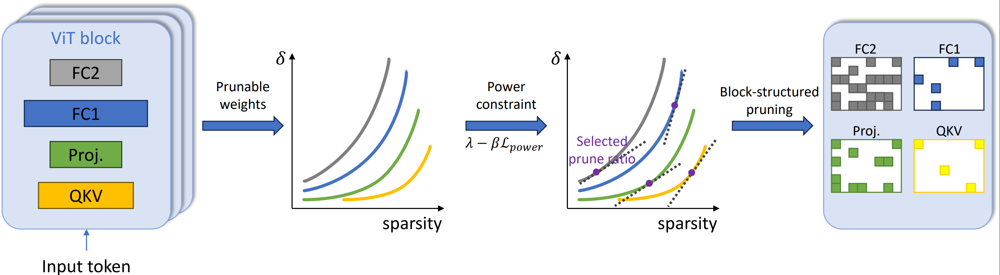
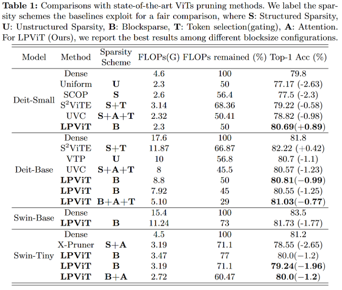

# LPViT: Low-Power Semi-structured Pruning for Vision Transformers

Official Pytorch implementation of ECCV'24 paper [_LPViT: Low-Power Semi-structured Pruning for Vision Transformers_](https://arxiv.org/abs/2407.02068) ([Kaixin Xu](https://xuk114.github.io/)\*, Zhe Wang\*, Chunyun Chen, Xue Geng, Jie Lin, Xulei Yang, Min Wu, Xiaoli Li, Weisi Lin).
- \*Equal contribution

<div align="center">
  
</div>


# Installation
1. Clone this repository
```sh
git clone https://github.com/Akimoto-Cris/LPViT.git
cd LPViT
```

2. Run nvidia-docker container: 
```sh
docker run -it --name lpvit --gpus all --shm-sizes=64g -v /path/to/LPViT/:/LPViT -v {/path/to/imagenet/}:/imagenet -w /LPViT nvcr.io/nvidia/pytorch:23.10-py3
```
3. Inside the container, `pip install timm==0.6.13`.
4. Install [nvidia-dali](https://docs.nvidia.com/deeplearning/dali/user-guide/docs/installation.html).


# Usage 
LPViT consists of two stages:
1. **Pruning**: perform empirical output distortion sampling on calibration set, solving layerwise sparsity allocation at the given flops target and masking the layer weights.
2. **Finetuning**: Finetune the pruned model on original dataset (ImageNet).


**Step1: Pruning**
- DeiT-B FLOPs 50% w/ blocksize 32x32:
```sh
python prune_vit.py --model deit_base_distilled_patch16_224 --blocksize 32 32 --data_path /imagenet --amount 0.5 --lambda_power 1 --flop_budget --second_order --smooth_curve
```

**Step2: Finetuning**
Run `bash scripts/taylor_flops5071_base_block32x32_secondorder_power.sh`
```sh
python -m torch.distributed.launch \
    --nproc_per_node=4 \
    --use_env finetune_vit.py \
    --model deit_base_distilled_patch16_224 \
    --batch-size 128 \
    --data-path /imagenet \
    --init_mask rd_curves/0/sp0.50_deit_base_distilled_patch16_224_ndz_0100_rdcurves_block32x32_ranking_taylor_secondorderapprox_opt_dist_mask_.pt \
    --init_weight rd_curves/0/sp0.50_deit_base_distilled_patch16_224_ndz_0100_rdcurves_block32x32_ranking_taylor_secondorderapprox_opt_dist_mask_.pt \
    --output_dir experiment/taylor1score_4gpus_deit_base_flop5071_block32x32_approx_taylorrank_derivative_secondorder_smooth0.9h4_min_sp0.05_power_distilled  \
    --dist_url 'tcp://127.0.0.1:33251' --distillation-type soft
```


We provide more pruning and finetuning scripts in scripts folder FYI. 


# Notes

Right now hardware benchmarking is not available yet, we are trying to support it in the near future. 

# Results 

LPViT achieve SOTA performance in ViTs pruning.

<div align="center">
  
</div>

# Acknowledgement

We adopt part of the training codes from [UVC](https://github.com/VITA-Group/UVC) for finetuning. We appreciate their great works!

# Citation

We appreciate it if you would please cite the following paper if you found the implementation useful for your work:
```
@article{xu2024lpvit,
  title={LPViT: Low-Power Semi-structured Pruning for Vision Transformers},
  author={Xu, Kaixin and Wang, Zhe and Chen, Chunyun and Geng, Xue and Lin, Jie and Yang, Xulei and Wu, Min and Li, Xiaoli and Lin, Weisi},
  journal={arXiv preprint arXiv:2407.02068},
  year={2024}
}
```
